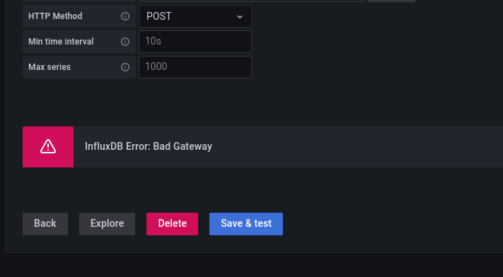
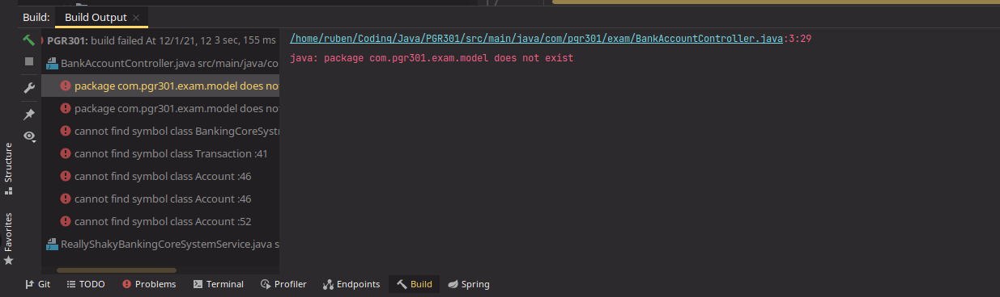

# PGR301 - eksamen

## Introduksjon
Relevante skjermbilder ligger i mappen `img`.
Denne mappen kan ignoreres og brukes bare for
å få inn bilder i denne filen.

## Oppgave: DevOps

1. For å hindre at kode som ikke kompilerer
   blir integrert i `main` bør man sette opp
   GitHub Actions for å sjekke om koden fungerer
   som den skal. Dette skal pushes til en branch
   som ikke er hoved-branchen (f.eks. `main`).
   Dette kan være så enkelt som å bare kompilere
   koden, men kan også inneholde for eksempel
   tester.
   Dette vil bli seende ut slik:
   
   Man kan også bruke for eksempel
   Travis eller CircleCI for dette.

2. For å sørge for at en pull request blir
   godkjent før merge må man sette opp
   Branch Protection.
   For å sette opp Branch Protection må man gå
   til `/settings/branches` i repositoriet,
   for eksempel `https://github.com/torvalds/linux/settings/branches`.
   Deretter lager man en regel for `main` (eller
   hva enn hovedbranchen heter).
   For å sørge for at en pull request blir
   godkjent før merge setter man opp Branch
   Protection slik:
   
   
3. For å gjøre arbeidsflyten så effektiv som
mulig når man jobber i team bør man jobbe i
   egne branches og sende pull requests
   til `main` branchen når koden er klar
   for deployment. Dette bør være regulert
   og teamet bør ha noen som ser over koden
   (code review) før pull.
   
4. Fordeling av oppgaver mellom SkalBank og
Team Dino er problematisk ettersom Team Dino
   driver med manuelle tester og er alt
   for stort for oppgaven.
   Man kan lett redusere antall ansatte
   i Team Dino ved å bruke CI og automatiske
   tester.
   Man kan ennå bruke Team Dino for å skrive
   tester, men i hovedsak skal antall manuelle
   tester være på et absolutt minimum.
   I verste fall kan man bruke manuelle tester
   hvor automatiske tester ikke strekker til.
   I hovedsak skal det meste være automatisk.
   
## Oppgave: Pipeline

For denne oppgaven brukte jeg GitHub Actions
ettersom det er lett å sette opp og krever
ikke at jeg forlater GitHub eller kobler
til noe annet. Actions fungerer veldig likt
som Travis og CircleCI med oppsett, integrasjon
og konfigurasjon. Filene ligger i
`.github`- mappen under `workflow`.
Denne workflowen bygger koden og lager
en `.jar`-fil, og repositoriet er 
lagt opp slik at man ikke kan pushe kode
som ikke kompilerer til `master/main`.

Jeg fikk dessverre ikke til å lage
enhetstester til programmet, men hadde
lagt opp tester for å sjekke API-elementene
samt tilkobling til en mock-server.

# Oppgave: Feedback

Jeg har gjort endringer i programmet som
produserer metrics på exception-klassene
i programmet. Dette er for å skaffe en
oversikt over hvorfor programmet produserer
exceptions hele tiden.
Måten metrics er lagt inn i klassene
er ved å legge funksjonskallet til
metrics-koden inn i constructor til klassen
og samtidig kalle `super()` for å forårsake
en exception.

Metrics blir sendt til Influx
som inkluderer informasjon om krasjen.

Man kan hente ut informasjonen i Influx
ved å spørre
```sql
select * from bankaccount_errors
```

Med Grafana hadde jeg problemer med å koble
opp Influx: 
Jeg kunne heller ikke kjøre applikasjonen
lenger ettersom IntelliJ bestemte seg
for å ha en liten episode: 
Det er verd å nevne at filene eksisterer,
og GitHub Actions har ingen problemer
med dem, bare lokal IntelliJ av en eller
annen grunn. (Er ikke teknologi _gøy_?)

# Oppgave: Terraform
Grunnen til at teamet ikke får kjøre
`terraform apply` med bucket-filen er
fordi en bucket med dette navnet allerede
eksisterer, og `resource` prøver å lage
ny bucket og feiler når en eksisterer.
Man bør da enten importere bucketen eller
bruke `data` for å slippe feilmeldingen.

Grunnen for at det fungerte for Jens
var at `.tfstate`-filen ble laget
mens han brukte en eldre versjon, hvor
dette problemet ikke var en ting,
men som senere har oppstått.

Ved bruk av følgende kommando fikk jeg laget
en bucket:
```bash
aws s3api create-bucket --bucket pgr301-ruda003-terraform --region eu-west-1 --create-bucket-configuration LocationConstraint=eu-west-1
```

Uten at brukeren har eksisterende nøkler
må vedkommende inn på AWS-siden for å
lage en nøkkel. Ved å så konfigurere
aws-cli kan man deretter bruke kommandoen
```bash
aws iam create-access-key
```
for å lage nye nøkler.